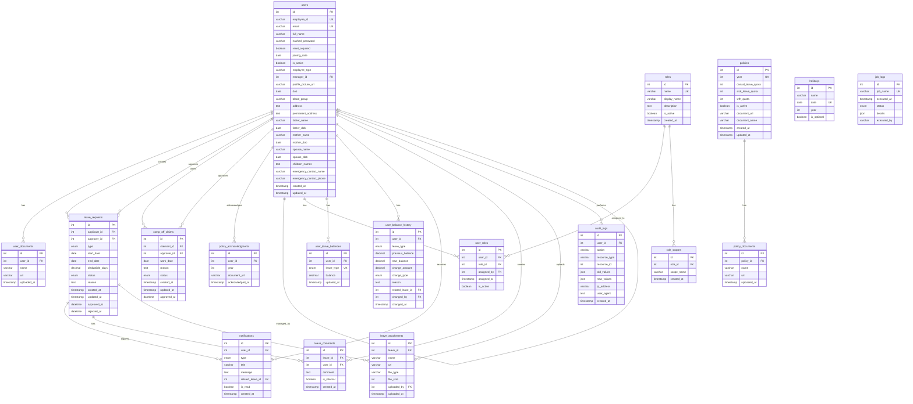

# Database Schema - Entity Relationship Diagram

```mermaid
erDiagram
    users ||--o{ user_documents : "has"
    users ||--o{ leave_requests : "creates"
    users ||--o{ leave_requests : "approves"
    users ||--o{ comp_off_claims : "claims"
    users ||--o{ comp_off_claims : "approves"
    users ||--o{ policy_acknowledgments : "acknowledges"
    users ||--o| users : "managed_by"
    users ||--o{ user_roles : "has"
    users ||--o{ user_leave_balances : "has"
    users ||--o{ user_balance_history : "has"
    users ||--o{ notifications : "receives"
    users ||--o{ leave_comments : "creates"
    users ||--o{ leave_attachments : "uploads"
    users ||--o{ audit_logs : "performs"
    policies ||--o{ policy_documents : "has"
    roles ||--o{ user_roles : "assigned_to"
    roles ||--o{ role_scopes : "has"
    leave_requests ||--o{ notifications : "triggers"
    leave_requests ||--o{ leave_comments : "has"
    leave_requests ||--o{ leave_attachments : "has"
    
    users {
        int id PK
        varchar employee_id UK
        varchar email UK
        varchar full_name
        varchar hashed_password
        boolean reset_required
        date joining_date
        boolean is_active
        varchar employee_type
        int manager_id FK
        varchar profile_picture_url
        date dob
        varchar blood_group
        text address
        text permanent_address
        varchar father_name
        date father_dob
        varchar mother_name
        date mother_dob
        varchar spouse_name
        date spouse_dob
        text children_names
        varchar emergency_contact_name
        varchar emergency_contact_phone
        timestamp created_at
        timestamp updated_at
    }
    
    roles {
        int id PK
        varchar name UK
        varchar display_name
        text description
        boolean is_active
        timestamp created_at
    }
    
    role_scopes {
        int id PK
        int role_id FK
        varchar scope_name
        timestamp created_at
    }
    
    user_roles {
        int id PK
        int user_id FK
        int role_id FK
        int assigned_by FK
        timestamp assigned_at
        boolean is_active
    }
    
    user_leave_balances {
        int id PK
        int user_id FK
        enum leave_type UK
        decimal balance
        timestamp updated_at
    }
    
    user_balance_history {
        int id PK
        int user_id FK
        enum leave_type
        decimal previous_balance
        decimal new_balance
        decimal change_amount
        enum change_type
        text reason
        int related_leave_id FK
        int changed_by FK
        timestamp changed_at
    }
    
    user_documents {
        int id PK
        int user_id FK
        varchar name
        varchar url
        timestamp uploaded_at
    }
    
    leave_requests {
        int id PK
        int applicant_id FK
        int approver_id FK
        enum type
        date start_date
        date end_date
        decimal deductible_days
        enum status
        text reason
        timestamp created_at
        timestamp updated_at
        datetime approved_at
        datetime rejected_at
    }
    
    comp_off_claims {
        int id PK
        int claimant_id FK
        int approver_id FK
        date work_date
        text reason
        enum status
        timestamp created_at
        timestamp updated_at
        datetime approved_at
    }
    
    holidays {
        int id PK
        varchar name
        date date UK
        int year
        boolean is_optional
    }
    
    policies {
        int id PK
        int year UK
        int casual_leave_quota
        int sick_leave_quota
        int wfh_quota
        boolean is_active
        varchar document_url
        varchar document_name
        timestamp created_at
        timestamp updated_at
    }
    
    policy_documents {
        int id PK
        int policy_id FK
        varchar name
        varchar url
        timestamp uploaded_at
    }
    
    policy_acknowledgments {
        int id PK
        int user_id FK
        int year
        varchar document_url
        timestamp acknowledged_at
    }
    
    job_logs {
        int id PK
        varchar job_name UK
        timestamp executed_at
        enum status
        json details
        varchar executed_by
    }
    
    notifications {
        int id PK
        int user_id FK
        enum type
        varchar title
        text message
        int related_leave_id FK
        boolean is_read
        timestamp created_at
    }
    
    leave_comments {
        int id PK
        int leave_id FK
        int user_id FK
        text comment
        boolean is_internal
        timestamp created_at
    }
    
    leave_attachments {
        int id PK
        int leave_id FK
        varchar name
        varchar url
        varchar file_type
        int file_size
        int uploaded_by FK
        timestamp uploaded_at
    }
    
    audit_logs {
        int id PK
        int user_id FK
        varchar action
        varchar resource_type
        int resource_id
        json old_values
        json new_values
        varchar ip_address
        text user_agent
        timestamp created_at
    }
```
